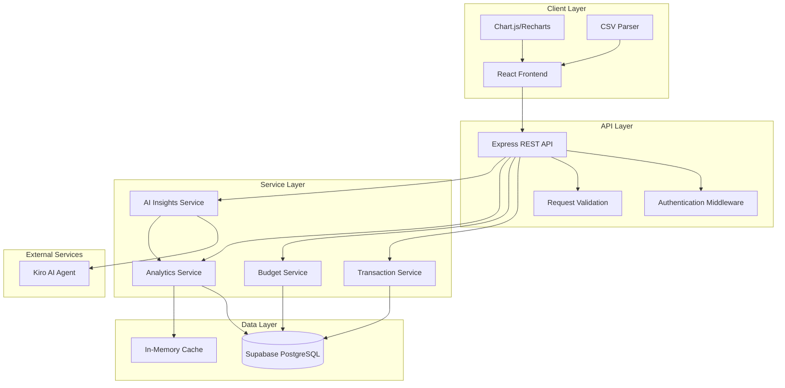
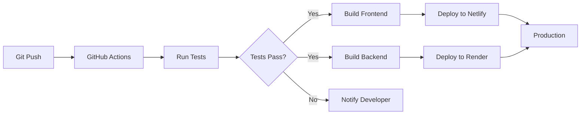

# Design Document

## Overview

The AI-Powered Personal Finance Tracker is a full-stack web application consisting of a React-based frontend, a Node.js/Express backend API, and an AI analysis service. The system uses Supabase for data persistence and integrates with an AI agent (Kiro) for generating natural-language financial insights. The architecture follows a three-tier pattern with clear separation between presentation, business logic, and data layers.

## Architecture

### System Architecture



### Technology Stack

**Frontend:**
- React 18 with TypeScript
- Recharts or Chart.js for visualizations
- TailwindCSS for styling
- React Query for data fetching and caching
- Papa Parse for CSV parsing
- Axios for HTTP requests

**Backend:**
- Node.js with Express
- TypeScript
- Supabase Client for database operations
- Node-cron for scheduled tasks (budget period resets)
- Express-validator for input validation

**Database:**
- Supabase (PostgreSQL)
- Row Level Security (RLS) for data isolation

**AI Integration:**
- Kiro AI Agent API for insights generation
- Custom prompt engineering for financial analysis

**Deployment:**
- Frontend: Netlify
- Backend: Render or Fly.io
- Database: Supabase Cloud
- Version Control: GitHub with CI/CD

## Components and Interfaces

### Frontend Components

#### 1. Dashboard Component
- **Purpose**: Main view displaying all financial information
- **Sub-components**:
  - `SummaryCards`: Display total spending, budget status, alerts
  - `ChartSection`: Container for all visualizations
  - `FilterBar`: Date range and category filters
  - `AIInsightsPanel`: Display AI-generated summaries
- **State Management**: React Query for server state, Context API for UI state

#### 2. Transaction Management Components
- **TransactionList**: Display all transactions in a table/list
- **TransactionForm**: Add/edit transaction modal
- **CSVUploader**: Drag-and-drop CSV upload interface
- **TransactionRow**: Individual transaction display with edit/delete actions

#### 3. Budget Management Components
- **BudgetList**: Display all budgets with progress bars
- **BudgetForm**: Create/edit budget modal
- **BudgetCard**: Individual budget display with visual progress
- **AlertBanner**: Display budget threshold alerts

#### 4. Visualization Components
- **CategoryPieChart**: Pie chart for category-wise spending
- **TrendLineChart**: Line/bar chart for spending trends over time
- **BudgetProgressChart**: Horizontal bar chart comparing budget vs actual
- **ChartFilters**: Controls for chart customization

#### 5. AI Insights Components
- **InsightsPanel**: Container for all AI-generated content
- **MonthlySummary**: Display monthly spending summary
- **CategoryInsights**: Show category-wise analysis
- **SpendingAlerts**: Highlight unusual spending patterns
- **Recommendations**: Display savings suggestions
- **Projections**: Show future spending predictions
- **ExportButton**: Download insights as PDF/text

### Backend API Endpoints

#### Transaction Endpoints
```
POST   /api/transactions          - Create single transaction
POST   /api/transactions/bulk     - Create multiple transactions (CSV upload)
GET    /api/transactions          - Get all transactions (with filters)
GET    /api/transactions/:id      - Get single transaction
PUT    /api/transactions/:id      - Update transaction
DELETE /api/transactions/:id      - Delete transaction
```

#### Budget Endpoints
```
POST   /api/budgets               - Create budget
GET    /api/budgets               - Get all budgets
GET    /api/budgets/:id           - Get single budget
PUT    /api/budgets/:id           - Update budget
DELETE /api/budgets/:id           - Delete budget
GET    /api/budgets/:id/progress  - Get budget progress and alerts
```

#### Analytics Endpoints
```
GET    /api/analytics/summary     - Get spending summary (total, by category, by period)
GET    /api/analytics/trends      - Get spending trends over time
GET    /api/analytics/categories  - Get category-wise breakdown
```

#### AI Insights Endpoints
```
POST   /api/insights/generate     - Generate AI insights for specified period
GET    /api/insights/latest       - Get most recent AI insights
POST   /api/insights/export       - Export insights as PDF/text
```

### Service Layer Interfaces

#### TransactionService
```typescript
interface TransactionService {
  create(transaction: TransactionInput): Promise<Transaction>
  createBulk(transactions: TransactionInput[]): Promise<Transaction[]>
  findAll(filters: TransactionFilters): Promise<Transaction[]>
  findById(id: string): Promise<Transaction | null>
  update(id: string, data: Partial<TransactionInput>): Promise<Transaction>
  delete(id: string): Promise<void>
  validateCSV(data: any[]): ValidationResult
}
```

#### BudgetService
```typescript
interface BudgetService {
  create(budget: BudgetInput): Promise<Budget>
  findAll(userId: string): Promise<Budget[]>
  findById(id: string): Promise<Budget | null>
  update(id: string, data: Partial<BudgetInput>): Promise<Budget>
  delete(id: string): Promise<void>
  calculateProgress(budgetId: string): Promise<BudgetProgress>
  checkThresholds(budgetId: string): Promise<Alert[]>
  resetPeriod(budgetId: string): Promise<void>
}
```

#### AnalyticsService
```typescript
interface AnalyticsService {
  getSummary(filters: AnalyticsFilters): Promise<SpendingSummary>
  getTrends(filters: TrendFilters): Promise<TrendData[]>
  getCategoryBreakdown(filters: CategoryFilters): Promise<CategoryData[]>
  getBudgetComparison(filters: BudgetFilters): Promise<BudgetComparison[]>
}
```

#### AIInsightsService
```typescript
interface AIInsightsService {
  generateInsights(userId: string, period: DateRange): Promise<AIInsights>
  getLatestInsights(userId: string): Promise<AIInsights | null>
  exportInsights(insightId: string, format: 'pdf' | 'text'): Promise<Buffer>
  buildPrompt(data: AnalyticsData): string
  parseAIResponse(response: string): AIInsights
}
```

## Data Models

### Database Schema

#### transactions table
```sql
CREATE TABLE transactions (
  id UUID PRIMARY KEY DEFAULT uuid_generate_v4(),
  user_id UUID NOT NULL REFERENCES auth.users(id),
  date DATE NOT NULL,
  amount DECIMAL(10, 2) NOT NULL,
  category VARCHAR(100) NOT NULL,
  merchant VARCHAR(255),
  notes TEXT,
  created_at TIMESTAMP DEFAULT NOW(),
  updated_at TIMESTAMP DEFAULT NOW()
);

CREATE INDEX idx_transactions_user_date ON transactions(user_id, date DESC);
CREATE INDEX idx_transactions_category ON transactions(user_id, category);
```

#### budgets table
```sql
CREATE TABLE budgets (
  id UUID PRIMARY KEY DEFAULT uuid_generate_v4(),
  user_id UUID NOT NULL REFERENCES auth.users(id),
  name VARCHAR(255) NOT NULL,
  amount DECIMAL(10, 2) NOT NULL,
  period_type VARCHAR(20) NOT NULL CHECK (period_type IN ('monthly', 'custom')),
  period_start DATE,
  period_end DATE,
  category VARCHAR(100),
  created_at TIMESTAMP DEFAULT NOW(),
  updated_at TIMESTAMP DEFAULT NOW()
);

CREATE INDEX idx_budgets_user ON budgets(user_id);
```

#### budget_alerts table
```sql
CREATE TABLE budget_alerts (
  id UUID PRIMARY KEY DEFAULT uuid_generate_v4(),
  budget_id UUID NOT NULL REFERENCES budgets(id) ON DELETE CASCADE,
  alert_type VARCHAR(20) NOT NULL CHECK (alert_type IN ('warning', 'critical')),
  threshold_percentage INTEGER NOT NULL,
  triggered_at TIMESTAMP DEFAULT NOW(),
  resolved_at TIMESTAMP,
  is_active BOOLEAN DEFAULT TRUE
);

CREATE INDEX idx_budget_alerts_budget ON budget_alerts(budget_id, is_active);
```

#### ai_insights table
```sql
CREATE TABLE ai_insights (
  id UUID PRIMARY KEY DEFAULT uuid_generate_v4(),
  user_id UUID NOT NULL REFERENCES auth.users(id),
  period_start DATE NOT NULL,
  period_end DATE NOT NULL,
  monthly_summary TEXT NOT NULL,
  category_insights JSONB NOT NULL,
  spending_spikes JSONB,
  recommendations JSONB,
  projections JSONB,
  generated_at TIMESTAMP DEFAULT NOW()
);

CREATE INDEX idx_ai_insights_user_date ON ai_insights(user_id, generated_at DESC);
```

### TypeScript Interfaces

```typescript
interface Transaction {
  id: string
  userId: string
  date: Date
  amount: number
  category: string
  merchant?: string
  notes?: string
  createdAt: Date
  updatedAt: Date
}

interface Budget {
  id: string
  userId: string
  name: string
  amount: number
  periodType: 'monthly' | 'custom'
  periodStart?: Date
  periodEnd?: Date
  category?: string
  createdAt: Date
  updatedAt: Date
}

interface BudgetProgress {
  budgetId: string
  budget: Budget
  currentSpending: number
  percentage: number
  remaining: number
  alerts: Alert[]
}

interface Alert {
  id: string
  budgetId: string
  alertType: 'warning' | 'critical'
  thresholdPercentage: number
  triggeredAt: Date
  resolvedAt?: Date
  isActive: boolean
}

interface AIInsights {
  id: string
  userId: string
  periodStart: Date
  periodEnd: Date
  monthlySummary: string
  categoryInsights: CategoryInsight[]
  spendingSpikes: SpendingSpike[]
  recommendations: string[]
  projections: Projection
  generatedAt: Date
}

interface CategoryInsight {
  category: string
  totalSpent: number
  percentageOfTotal: number
  insight: string
}

interface SpendingSpike {
  date: Date
  amount: number
  category: string
  description: string
}

interface Projection {
  nextWeek: number
  nextMonth: number
  confidence: 'high' | 'medium' | 'low'
  explanation: string
}
```

## Error Handling

### Error Types and Responses

```typescript
enum ErrorCode {
  VALIDATION_ERROR = 'VALIDATION_ERROR',
  NOT_FOUND = 'NOT_FOUND',
  UNAUTHORIZED = 'UNAUTHORIZED',
  DATABASE_ERROR = 'DATABASE_ERROR',
  AI_SERVICE_ERROR = 'AI_SERVICE_ERROR',
  CSV_PARSE_ERROR = 'CSV_PARSE_ERROR'
}

interface ErrorResponse {
  code: ErrorCode
  message: string
  details?: any
  timestamp: Date
}
```

### Error Handling Strategy

1. **Validation Errors (400)**
   - Invalid input data
   - Missing required fields
   - CSV format errors
   - Return detailed field-level errors

2. **Not Found Errors (404)**
   - Transaction/Budget not found
   - Return clear message with resource ID

3. **Database Errors (500)**
   - Connection failures
   - Query errors
   - Implement retry logic (up to 3 attempts)
   - Log errors for debugging

4. **AI Service Errors (503)**
   - AI agent unavailable
   - Timeout errors
   - Return cached insights if available
   - Graceful degradation

5. **Frontend Error Handling**
   - Display user-friendly error messages
   - Toast notifications for transient errors
   - Error boundaries for component failures
   - Retry mechanisms for failed requests

## Testing Strategy

### Unit Testing

**Backend Services:**
- Test each service method in isolation
- Mock database calls using test doubles
- Test edge cases and error conditions
- Target: 80% code coverage

**Frontend Components:**
- Test component rendering
- Test user interactions
- Test state management
- Use React Testing Library

**Test Files:**
- `transaction.service.test.ts`
- `budget.service.test.ts`
- `analytics.service.test.ts`
- `ai-insights.service.test.ts`

### Integration Testing

**API Endpoints:**
- Test complete request/response cycles
- Use test database for integration tests
- Test authentication and authorization
- Test error scenarios

**Database Operations:**
- Test CRUD operations
- Test complex queries
- Test transaction handling
- Test constraints and indexes

### End-to-End Testing

**Critical User Flows:**
- Upload CSV → View transactions → See dashboard
- Create budget → Add transactions → Receive alerts
- Generate AI insights → Export summary
- Use Playwright or Cypress for E2E tests

### AI Integration Testing

**AI Service:**
- Test prompt generation with sample data
- Test response parsing
- Mock AI agent responses for consistent testing
- Validate insight quality with sample datasets

### Performance Testing

**Metrics to Monitor:**
- Dashboard load time (< 2 seconds)
- Chart rendering time (< 500ms)
- API response time (< 200ms for simple queries)
- CSV upload processing (< 5 seconds for 1000 transactions)

**Tools:**
- Lighthouse for frontend performance
- Artillery or k6 for API load testing

## Security Considerations

### Authentication & Authorization
- Use Supabase Auth for user management
- Implement Row Level Security (RLS) policies
- JWT tokens for API authentication
- Secure session management

### Data Protection
- Encrypt sensitive data at rest
- Use HTTPS for all communications
- Sanitize user inputs to prevent injection attacks
- Implement rate limiting on API endpoints

### API Security
- CORS configuration for allowed origins
- Input validation on all endpoints
- SQL injection prevention through parameterized queries
- XSS prevention through output encoding

## Deployment Architecture

### Frontend Deployment (Netlify)
- Build command: `npm run build`
- Publish directory: `dist` or `build`
- Environment variables: API_URL, SUPABASE_URL, SUPABASE_ANON_KEY
- Automatic deployments on main branch push

### Backend Deployment (Render/Fly.io)
- Docker container or Node.js runtime
- Environment variables: DATABASE_URL, AI_AGENT_API_KEY, JWT_SECRET
- Health check endpoint: `/health`
- Auto-scaling based on load

### Database (Supabase)
- Managed PostgreSQL instance
- Automatic backups
- Connection pooling
- RLS policies enabled

### CI/CD Pipeline


## AI Insights Implementation

### Prompt Engineering

The AI Insights Service will construct prompts with the following structure:

```
You are a financial advisor analyzing a user's spending patterns.

Period: [start_date] to [end_date]
Total Spending: $[total]
Number of Transactions: [count]

Category Breakdown:
- [category]: $[amount] ([percentage]%)
[repeat for all categories]

Top Merchants:
- [merchant]: $[amount]
[repeat for top 5]

Budget Status:
- [budget_name]: [percentage]% used ($[spent] of $[limit])
[repeat for all budgets]

Please provide:
1. A brief monthly summary (2-3 sentences)
2. Insights for each major spending category
3. Any unusual spending spikes or patterns
4. 3-5 personalized savings recommendations
5. Spending projections for next week and next month

Format your response as JSON with the following structure:
{
  "monthlySummary": "...",
  "categoryInsights": [...],
  "spendingSpikes": [...],
  "recommendations": [...],
  "projections": {...}
}
```

### Response Processing

The AI service will:
1. Parse the JSON response from the AI agent
2. Validate the structure
3. Store insights in the database
4. Cache for quick retrieval
5. Handle parsing errors gracefully

### Caching Strategy

- Cache AI insights for 24 hours
- Regenerate on demand or when significant new data is added
- Store in database for historical reference
- Use in-memory cache for current period insights
